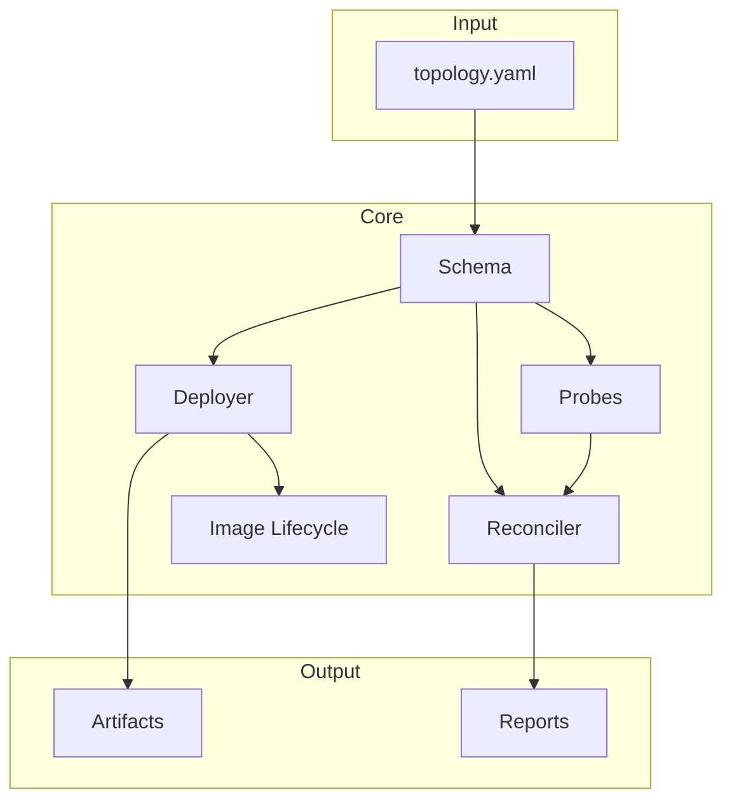

# rw_blueprint — Product Documentation

**Version:** 0.2.0  
**Status:** Production Ready  
**Repository:** [RapidWebs-Enterprise/rw_blueprint](https://github.com/RapidWebs-Enterprise/rw_blueprint)

---

## Executive Summary

rw_blueprint is a declarative infrastructure-as-code engine that treats `topology.yaml` as the single source of truth for the RapidWebs Distributed Network (RWDN). It validates topology definitions, generates deployment artifacts, probes live infrastructure, detects drift, and proposes remediation—all gated behind human-in-the-loop approval.

### Key Value Propositions

| Value | Description |
|-------|-------------|
| **Single Source of Truth** | One YAML file defines your entire infrastructure |
| **Drift Detection** | Automated comparison between declared and actual state |
| **Safe Deployments** | Dependency ordering, health checks, automatic rollback |
| **Agent Integration** | MCP server for AI agent consumption |
| **Production Ready** | 194 passing tests, comprehensive documentation |

---

## Features Overview

### 1. Validation (`validate`)

```bash
rw-blueprint validate topology.yaml
```

- Schema validation with Pydantic v2 strict mode
- Cross-reference validation (zones, nodes, dependencies)
- Structured port parsing
- Error reporting with line numbers

### 2. Generation (`generate`)

```bash
rw-blueprint generate topology.yaml --output docs/generated/
```

Produces:
- **Quadlet containers** — Podman systemd units
- **Incus profiles** — Container profiles
- **Mermaid diagrams** — Architecture visualization
- **Markdown docs** — Topology documentation

### 3. Probing (`probe`)

```bash
rw-blueprint probe --nodes srv1,infra,enterprise,dev
```

Probe types:
- **incus** — Container status and profiles
- **podman** — Running containers and images
- **port** — Listening network ports
- **dns** — Name resolution
- **tailscale** — Mesh peer status

### 4. Reconciliation (`reconcile`)

```bash
rw-blueprint reconcile topology.yaml live-state.json
```

Drift classification:
- **Missing** — In topology, absent in live state
- **Extra** — Present in live, not in topology
- **Mismatched** — Different attributes

Severity tiers:
- **Critical** — Service outage risk
- **Warning** — Potential inconsistency
- **Info** — Minor deviation

### 5. Deployment (`deploy`)

```bash
rw-blueprint deploy topology.yaml --node infra --dry-run
rw-blueprint deploy topology.yaml --node infra
```

Safety features:
- Dry-run mode (`--dry-run`)
- Confirmation prompts (skip with `--force`)
- Health verification post-deploy
- Automatic rollback on failure
- Partial failure handling (`continue_on_failure`)
- Artifact preservation for rollback

### 6. Image Lifecycle (`image`)

```bash
rw-blueprint image list --node infra
rw-blueprint image build my-service --source /path/to/source --node infra
rw-blueprint image pull myimage:latest --registry ghcr.io
rw-blueprint image prune --node infra --keep-latest 5
```

Security:
- Path traversal protection
- Label sanitization
- Disk space validation
- Retry with exponential backoff

---

## Architecture

### Component Diagram



### Data Flow

1. **Load** — Parse and validate `topology.yaml`
2. **Generate** — Create deployment artifacts
3. **Probe** — Collect live infrastructure state
4. **Reconcile** — Compare declared vs actual
5. **Deploy** — Execute with safety gates
6. **Verify** — Health checks and rollback if needed

---

## Configuration

### Layered Configuration (highest priority first)

1. **CLI flags** — `--node`, `--force`, etc.
2. **Environment variables** — `RW_BLUEPRINT_` prefix
3. **User config** — `~/.rw_blueprint/config.yaml`
4. **Project config** — `config/defaults.yaml`
5. **Pydantic defaults**

### Example User Config

```yaml
# ~/.rw_blueprint/config.yaml
ssh:
  default_user: sysop
  key_path: ~/.ssh/id_ed25519
  timeout: 30

probes:
  timeout: 30
  retry_count: 3

deploy:
  continue_on_failure: true
  auto_rollback: true
  health_check_timeout: 60
```

---

## MCP Server

### Tools (4)

| Tool | Purpose |
|------|---------|
| `validate_topology` | Validate YAML against schema |
| `generate_artifacts_tool` | Generate docs/IaC |
| `run_probes` | Collect live state |
| `reconcile_topology` | Compare declared vs actual |

### Resources (2)

| URI | Description |
|-----|-------------|
| `topology://{path}` | Read topology YAML |
| `schema://version` | Get schema version |

### Usage

```bash
# Start MCP server (stdio)
uv run rw-blueprint mcp

# Start MCP server (HTTP/SSE)
uv run rw-blueprint mcp --http
```

---

## Testing

```bash
# Run all tests
uv run pytest

# Run with coverage
uv run pytest --cov=src/rw_blueprint

# Run specific category
uv run pytest tests/test_schema.py -v
```

**Current: 194 tests passing**

---

## CI/CD

### GitHub Actions Jobs

1. **test** — Python 3.11/3.12/3.13 matrix, lint + format + types + tests
2. **build** — Wheel + sdist + smoke tests
3. **security** — pip-audit + gitleaks

---

## Documentation Structure

```
rw_blueprint/
├── README.md                    # Project overview
├── ARCHITECTURE.md              # System design
├── CHANGELOG.md                 # Version history
├── CONTRIBUTING.md              # Contribution guidelines
├── LICENSE                      # MIT License
├── SECURITY.md                  # Security policy
├── SUPPORT.md                   # Support channels
│
├── docs/
│   ├── demo/                    # Product demo site
│   │   ├── index.html           # Landing page
│   │   └── README.md            # This file
│   ├── guides/
│   │   ├── deployment.md       # Deployment workflows
│   │   └── troubleshooting.md  # Common issues
│   ├── specs/
│   │   ├── RWBP-2026-001.md    # Core engine spec
│   │   ├── RWBP-2026-002.md    # Reconcile layer spec
│   │   └── RWBP-2026-003.md    # Image lifecycle spec
│   ├── adrs/
│   │   ├── 0001-*.md           # 20 Architecture Decision Records
│   │   └── ...
│   └── audits/
│       ├── forward-audit-*.md  # Forward audits
│       └── reverse-audit-*.md  # Reverse audits
│
├── examples/
│   ├── basic-topology.yaml      # Minimal example
│   ├── advanced-topology.yaml   # Multi-node example
│   └── minimal-topology.yaml    # Bare-bones reference
│
└── openapi.json                 # MCP server API spec
```

---

## Quick Start

```bash
# Install
git clone https://github.com/RapidWebs-Enterprise/rw_blueprint.git
cd rw_blueprint
uv pip install -e ".[dev,mcp]"

# Validate an example
rw-blueprint validate examples/basic-topology.yaml

# Generate artifacts
rw-blueprint generate examples/basic-topology.yaml --output docs/generated/

# Preview deployment
rw-blueprint deploy examples/basic-topology.yaml --node localhost --dry-run
```

---

## License

MIT License — See [LICENSE](../LICENSE) for details.

---

**Last Updated:** 2026-09-19  
**Maintained by:** RapidWebs Infrastructure Team
